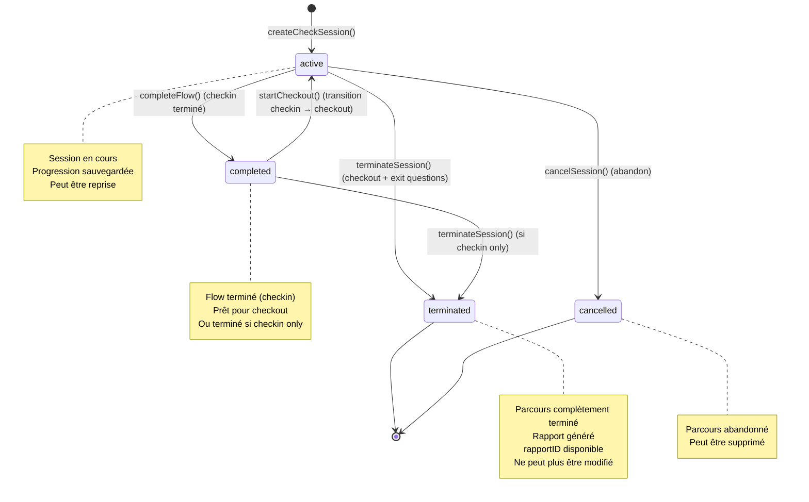

# 🔄 FLUX DE PARCOURS - Analyse Détaillée

> **Date de création** : 2025-01-09  
> **Objectif** : Documenter tous les types de parcours et leurs états possibles

---

## 📋 TYPES DE PARCOURS

### 1. **Parcours MÉNAGE SEUL** (Checkout Only)
**Configuration API** :
- `parcoursType`: "menage" ou similaire
- `takePicture`: "checkOutOnly" ou "both"
- Pas de checkin requis

**Flux** :
```
Welcome → CheckEasy → Checkout → Exit Questions → Checkout Home (Terminé)
```

**Caractéristiques** :
- Pas d'état des lieux d'entrée
- Focus sur le nettoyage et l'état de sortie
- Photos uniquement à la sortie
- Utilisé pour : ménages entre voyageurs, ménages de routine

---

### 2. **Parcours VOYAGE COMPLET** (Checkin + Checkout)
**Configuration API** :
- `parcoursType`: "voyage" ou similaire
- `takePicture`: "both"
- Checkin ET checkout requis

**Flux** :
```
Welcome → CheckEasy → Checkin → Checkin Home → Checkout → Exit Questions → Checkout Home (Terminé)
```

**Caractéristiques** :
- État des lieux d'entrée complet
- Ménage entre checkin et checkout
- État des lieux de sortie complet
- Photos à l'entrée ET à la sortie
- Utilisé pour : locations courte durée, Airbnb, etc.

---

### 3. **Parcours CHECKIN SEUL** (Checkin Only)
**Configuration API** :
- `parcoursType`: "checkin" ou similaire
- `takePicture`: "checkInOnly"
- Uniquement checkin

**Flux** :
```
Welcome → CheckEasy → Checkin → Checkin Home (Terminé)
```

**Caractéristiques** :
- Uniquement état des lieux d'entrée
- Pas de ménage
- Pas de checkout
- Photos uniquement à l'entrée
- Utilisé pour : début de location longue durée

---

### 4. **Parcours AVEC ÉTAT INITIAL** (Ménage avec inspection)
**Configuration API** :
- `parcoursType`: "menage" avec option état initial
- `takePicture`: "checkOutOnly" ou "both"
- Inspection avant ménage

**Flux** :
```
Welcome → CheckEasy → État Initial → Checkout Home → Checkout → Exit Questions → Checkout Home (Terminé)
```

**Caractéristiques** :
- Inspection de l'état initial avant de commencer le ménage
- Signalement des problèmes déjà présents
- Photos des problèmes détectés
- Puis ménage normal
- Utilisé pour : ménages avec responsabilité, inspections avant travaux

---

## 🎯 ÉTATS DE SESSION

### Diagramme d'états



---

## 📊 MATRICE DE TRANSITIONS D'ÉTAT

| État actuel | Action | État suivant | Conditions |
|-------------|--------|--------------|------------|
| `active` | Compléter toutes les tâches checkin | `completed` | `flowType === 'checkin'` |
| `active` | Compléter toutes les tâches checkout + exit questions | `terminated` | `flowType === 'checkout'` |
| `active` | Annuler le parcours | `cancelled` | User action |
| `completed` | Démarrer checkout | `active` | Nouveau checkId créé avec `flowType === 'checkout'` |
| `completed` | Terminer (si checkin only) | `terminated` | Pas de checkout requis |
| `terminated` | - | - | **État final** - Aucune transition possible |
| `cancelled` | - | - | **État final** - Aucune transition possible |

---

## 🔀 TRANSITIONS ENTRE FLOWS

### Transition Checkin → Checkout

**Scénario** : Parcours voyage complet

**Étapes** :
1. User termine toutes les tâches de checkin
2. Auto-navigation vers `/checkin-home`
3. Session checkin passe à `status: 'completed'`
4. User clique sur "Commencer le checkout"
5. **CRÉATION D'UNE NOUVELLE SESSION** :
   - Nouveau `checkId` généré
   - `flowType: 'checkout'`
   - `status: 'active'`
   - Même `parcoursId` et `userId`
6. Navigation vers `/checkout` avec nouveau checkId
7. User effectue le checkout
8. Complétion → `status: 'terminated'`

**⚠️ IMPORTANT** : 
- Checkin et Checkout sont **deux sessions distinctes**
- Chaque session a son propre `checkId`
- Les deux sessions partagent le même `parcoursId`

---

## 🗺️ ROUTES AUTORISÉES PAR ÉTAT

### État : `active` (flowType: 'checkin')

| Route | Autorisée | Redirection si non autorisée |
|-------|-----------|------------------------------|
| `/welcome` | ✅ | - |
| `/` | ✅ | - |
| `/checkin` | ✅ | - |
| `/checkin-home` | ❌ | `/checkin` (si pas terminé) |
| `/checkout` | ❌ | `/checkin` |
| `/checkout-home` | ❌ | `/checkin` |
| `/etat-initial` | ✅ | - |
| `/exit-questions` | ❌ | `/checkin` |

---

### État : `completed` (flowType: 'checkin')

| Route | Autorisée | Redirection si non autorisée |
|-------|-----------|------------------------------|
| `/welcome` | ✅ | - |
| `/` | ✅ | - |
| `/checkin` | ❌ | `/checkin-home` (déjà terminé) |
| `/checkin-home` | ✅ | - |
| `/checkout` | ❌ | `/checkin-home` (doit créer nouvelle session) |
| `/checkout-home` | ❌ | `/checkin-home` |
| `/etat-initial` | ❌ | `/checkin-home` |
| `/exit-questions` | ❌ | `/checkin-home` |

---

### État : `active` (flowType: 'checkout')

| Route | Autorisée | Redirection si non autorisée |
|-------|-----------|------------------------------|
| `/welcome` | ✅ | - |
| `/` | ✅ | - |
| `/checkin` | ❌ | `/checkout` |
| `/checkin-home` | ❌ | `/checkout` |
| `/checkout` | ✅ | - |
| `/checkout-home` | ❌ | `/checkout` (si pas terminé) |
| `/etat-initial` | ✅ | - |
| `/exit-questions` | ❌ | `/checkout` (si pas terminé) |

---

### État : `terminated` (flowType: 'checkout')

| Route | Autorisée | Redirection si non autorisée |
|-------|-----------|------------------------------|
| `/welcome` | ✅ | - |
| `/` | ✅ | - |
| `/checkin` | ❌ | `/checkout-home` |
| `/checkin-home` | ❌ | `/checkout-home` |
| `/checkout` | ❌ | `/checkout-home` (déjà terminé) |
| `/checkout-home` | ✅ | - |
| `/etat-initial` | ❌ | `/checkout-home` |
| `/exit-questions` | ❌ | `/checkout-home` (déjà répondu) |

---

## 🎬 SCÉNARIOS DÉTAILLÉS

### Scénario 1 : Nouveau parcours ménage seul

```
1. User clique sur lien Bubble : /welcome?parcours=XXX
2. Welcome charge le parcours
3. User remplit le formulaire
4. Création checkId avec flowType='checkout'
5. Navigation vers /?parcours=XXX&checkid=YYY
6. User sélectionne "Commencer le ménage"
7. Navigation vers /checkout
8. User complète toutes les tâches
9. Auto-navigation vers /exit-questions
10. User répond aux questions
11. Session terminée (status='terminated', rapportID généré)
12. Navigation vers /checkout-home
13. Affichage du lien vers le rapport Bubble
```

---

### Scénario 2 : Nouveau parcours voyage complet

```
1. User clique sur lien Bubble : /welcome?parcours=XXX
2. Welcome charge le parcours
3. User remplit le formulaire
4. Création checkId_1 avec flowType='checkin'
5. Navigation vers /?parcours=XXX&checkid=checkId_1
6. User sélectionne "État des lieux d'entrée"
7. Navigation vers /checkin
8. User complète toutes les tâches checkin
9. Auto-navigation vers /checkin-home
10. Session checkin_1 passe à status='completed'
11. User clique "Commencer le checkout"
12. Création checkId_2 avec flowType='checkout'
13. Navigation vers /checkout?parcours=XXX&checkid=checkId_2
14. User complète toutes les tâches checkout
15. Auto-navigation vers /exit-questions
16. User répond aux questions
17. Session checkout_2 terminée (status='terminated', rapportID généré)
18. Navigation vers /checkout-home
19. Affichage du lien vers le rapport Bubble
```

---

### Scénario 3 : Reprise de session après interruption

```
1. User était sur /checkout (checkId=YYY, progression 50%)
2. User ferme l'onglet
3. User rouvre le lien : /welcome?parcours=XXX&checkid=YYY
4. Welcome détecte le checkId dans l'URL
5. Welcome charge la session depuis IndexedDB
6. Welcome restaure les infos utilisateur
7. Welcome lit progress.navigation.lastPath = '/checkout'
8. Navigation vers /checkout?parcours=XXX&checkid=YYY
9. CheckOut charge l'état depuis IndexedDB
10. Restauration de la progression (pièce actuelle, tâches complétées, photos)
11. User continue là où il s'était arrêté
```

---

### Scénario 4 : Parcours avec état initial

```
1. User clique sur lien Bubble : /welcome?parcours=XXX
2. Welcome charge le parcours
3. User remplit le formulaire
4. Création checkId avec flowType='checkout'
5. Navigation vers /?parcours=XXX&checkid=YYY
6. User sélectionne "État initial"
7. Navigation vers /etat-initial
8. User marque les pièces (correct/déplorable)
9. User prend photos des problèmes
10. User valide l'état initial
11. Signalements envoyés à Bubble
12. Navigation vers /checkout-home
13. User clique "Commencer le ménage"
14. Navigation vers /checkout
15. [Suite normale du checkout...]
```

---

## 🔑 RÈGLES MÉTIER

### Règle 1 : Unicité du checkId actif
- Un utilisateur ne peut avoir qu'**un seul checkId actif** à la fois
- Stocké dans `localStorage.activeCheckId`
- Si création d'un nouveau checkId, l'ancien est remplacé

### Règle 2 : Persistance de la progression
- Toute interaction doit être sauvegardée dans IndexedDB
- Photos, tâches complétées, signalements, navigation
- Permet la reprise après interruption

### Règle 3 : Transition checkin → checkout
- Nécessite la création d'une **nouvelle session**
- Nouveau checkId généré
- Même parcoursId conservé
- Session checkin passe à `completed`

### Règle 4 : Session terminée = immuable
- Une session `terminated` ne peut plus être modifiée
- Toute tentative d'accès aux pages de flow redirige vers `/checkout-home`
- Le rapport Bubble est généré et accessible

### Règle 5 : Paramètres URL obligatoires
- Toutes les pages (sauf `/welcome` sans checkId) nécessitent `?parcours=XXX&checkid=YYY`
- Si paramètres manquants → redirection vers `/welcome`

---

**Suite du document** : Voir `PROBLEMES_ACTUELS.md`

